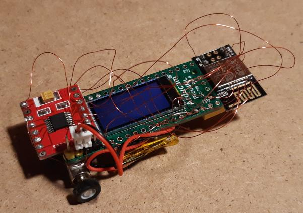

## Fork mission statement
Make ampy work over telnet without login+password, as needed when using ESP8266/ESP8285 modules with WifiToSerial.ino sketch to allow for wireless MicroPyton REPL of serially connected to MCU (eg. Raspberry Pico, which has no Wifi).

Install:

    sudo python3 setup.py install

One of the robots with RP2040 MCU, that has wireless MicroPython REPL through ESP8285 module on front, connected serially to Pico4ML MCU:  

    pi@raspberryPi400:~ $ ampy -p 192.168.178.103 ls
    /boot.py
    pi@raspberryPi400:~ $ echo -e "foo\nbar" > test.dat
    pi@raspberryPi400:~ $ ampy -p 192.168.178.103 put test.dat 
    pi@raspberryPi400:~ $ ampy -p 192.168.178.103 ls
    /boot.py
    /test.dat
    pi@raspberryPi400:~ $ 


  
# ampy replacement
We have been working on the next version of ampy which will solve various problems with the current system. Based on a new modular architecture, it makes adding device support and features very simple using plugins. It also aims to support coding over WiFi for supported devices. This should eliminate the need to have a wired connection and improve reliability as well.
[Here](https://github.com/curiouswala/ampy-2) is an alpha release please go ahead and play with it. Leave suggestions for a new name in the issue section. :)

## ampy

MicroPython Tool (ampy) - Utility to interact with a CircuitPython or MicroPython board over a serial connection.

Ampy is meant to be a simple command line tool to manipulate files and run code on a CircuitPython or
MicroPython board over its serial connection.
With ampy you can send files from your computer to the
board's file system, download files from a board to your computer, and even send a Python script
to a board to be executed.

Note that ampy by design is meant to be simple and does not support advanced interaction like a shell
or terminal to send input to a board.  Check out other MicroPython tools
like [rshell](https://github.com/dhylands/rshell)
or [mpfshell](https://github.com/wendlers/mpfshell) for more advanced interaction with boards.

## Installation

You can use ampy with either Python 2.7.x or 3.x and can install it easily from
Python's package index.  On MacOS or Linux, in a terminal run the following command (assuming
Python 3):

    pip3 install --user adafruit-ampy

On Windows, do:

    pip install adafruit-ampy

Note on some Linux and Mac OSX systems you might need to run as root with sudo:

    sudo pip3 install adafruit-ampy

If you don't have Python 3 then try using Python 2 with:

    pip install adafruit-ampy

Once installed verify you can run the ampy program and get help output:

    ampy --help

You should see usage information displayed like below:

    Usage: ampy [OPTIONS] COMMAND [ARGS]...

      ampy - Adafruit MicroPython Tool

      Ampy is a tool to control MicroPython boards over a serial connection.
      Using ampy you can manipulate files on the board's internal filesystem and
      even run scripts.

    Options:
      -p, --port PORT  Name of serial port for connected board.  [required]
      -b, --baud BAUD  Baud rate for the serial connection. (default 115200)
      -d, --delay DELAY Delay in seconds before entering RAW MODE (default 0)
      --help           Show this message and exit.

    Commands:
      get  Retrieve a file from the board.
      ls   List contents of a directory on the board.
      put  Put a file on the board.
      rm   Remove a file from the board.
      run  Run a script and print its output.

If you'd like to install from the Github source then use the standard Python
setup.py install (or develop mode):

    python3 setup.py install

Note to run the unit tests on Python 2 you must install the mock library:

    pip install mock

## Usage

Ampy is made to talk to a CircuitPython MicroPython board over its serial connection.  You will
need your board connected and any drivers to access it serial port installed.
Then for example to list the files on the board run a command like:

    ampy --port /dev/tty.SLAB_USBtoUART ls

You should see a list of files on the board's root directory printed to the
terminal.  Note that you'll need to change the port parameter to the name or path
to the serial port that the MicroPython board is connected to.

Other commands are available, run ampy with --help to see more information:

    ampy --help

Each subcommand has its own help, for example to see help for the ls command  run (note you
unfortunately must have a board connected and serial port specified):

    ampy --port /dev/tty.SLAB_USBtoUART ls --help

## Configuration

For convenience you can set an `AMPY_PORT` environment variable which will be used
if the port parameter is not specified.  For example on Linux or OSX:

    export AMPY_PORT=/dev/tty.SLAB_USBtoUART
    ampy ls

Or on Windows (untested) try the SET command:

    set AMPY_PORT=COM4
    ampy ls

Similarly, you can set `AMPY_BAUD` and `AMPY_DELAY` to control your baud rate and
the delay before entering RAW MODE.

To set these variables automatically each time you run `ampy`, copy them into a
file named `.ampy`:

```sh
# Example .ampy file
# Please fill in your own port, baud rate, and delay
AMPY_PORT=/dev/cu.wchusbserial1410
AMPY_BAUD=115200
# Fix for macOS users' "Could not enter raw repl"; try 2.0 and lower from there:
AMPY_DELAY=0.5
```

You can put the `.ampy` file in your working directory, one of its parents, or in
your home directory.
